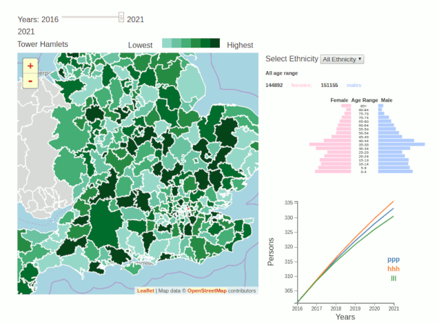
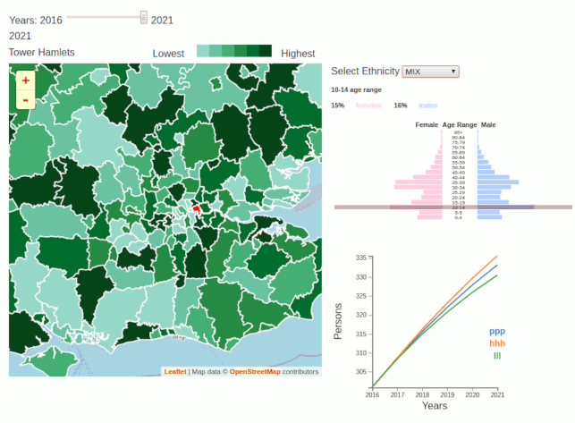

# Designing and implementing an innovative visualisation engine for SPENSER

SPENSER, Synthetic Population Estimation and Scenario Projection Model, is is a comprehensive synthetic population estimation and projection model that employs dynamic microsimulation techniques. SPENSER provides a set of tools to allows the user to customise scenario parametrs to generate a scenario projection output and visualise it. 

The aim of this project is to create an innovative visualisation engine which combines interactive maps and projections plots. This visualisation engine will communicate findings effectively to support the evidence-based decision making as well as produce more explainable simulation results, revealing their usefulness.

### A web-based dashboard-like interactive visualistion tool to display:
 
* Population distribution structure by age and sex 
* Population projection variants
* Population projection's choropleth Map 

### With the follow features

* Filter by year
* Filter by ethnicity
* Filter by geography, clicking on the map
 
## Usage

### Prerequisites

* Apache Server - HTPP server
* [Leaflet](https://leafletjs.com/) - interactive maps library
* [D3](https://d3js.org/)            - visualisation library 

### Clone the repo

To clone the repo in appache server in Ubuntu
  * cd /var/www/html/
  * mkdir spencer
  * cd spenser
  * git clone https://github.com/aniuska/Visualisation-spenser

Then go to: http://localhost/spenser/

### Application structure
* index.html - The entry point to our application
* spenser.js - This file open datasets and call visualisation modules
* The remainder files create and define the plots

### Data

The population projection data were generated using the [ukpopulation](https://github.com/nismod/ukpopulation) and [humanleague](https://github.com/virgesmith/humanleague) packages for the Local Authorities Districs (LADs) in England between 2016 to 2021. A GeoJSON file for England and Wales, and the lookup dataset were downlown from [ONS](https://www.ons.gov.uk/).

#### Data processing
The generated dataset for population structure was processed and transformed, in Python, to a more convenient data structure to avoid complex calculations and pre-processing on the visualisation engine. Two new columns were added to the lookup dataset, the project population counts and year, for the choropleth Map. The VARIANT column was also added to the projection variants dataset. See the resulted datasets bel

##### Population structure dataset
<table border="1" class="dataframe">
  <thead>
    <tr style="text-align: right;">
      <th></th>
      <th>Ethnicity</th>
      <th>Age_Range</th>
      <th>F</th>
      <th>M</th>
      <th>Year</th>
    </tr>
  </thead>
  <tbody>
    <tr>
      <th>0</th>
      <td>BAN</td>
      <td>0-4</td>
      <td>4514</td>
      <td>4710</td>
      <td>2012</td>
    </tr>
    <tr>
      <th>1</th>
      <td>BAN</td>
      <td>10-14</td>
      <td>4161</td>
      <td>4283</td>
      <td>2012</td>
    </tr>
    <tr>
      <th>2</th>
      <td>BAN</td>
      <td>15-19</td>
      <td>3599</td>
      <td>3795</td>
      <td>2012</td>
    </tr>
    <tr>
      <th>3</th>
      <td>BAN</td>
      <td>20-24</td>
      <td>3857</td>
      <td>3936</td>
      <td>2012</td>
    </tr>
    <tr>
      <th>4</th>
      <td>BAN</td>
      <td>25-29</td>
      <td>4578</td>
      <td>4120</td>
      <td>2012</td>
    </tr>
    <tr>
      <th>5</th>
      <td>BAN</td>
      <td>30-34</td>
      <td>4302</td>
      <td>4014</td>
      <td>2012</td>
    </tr>
    <tr>
      <th>6</th>
      <td>BAN</td>
      <td>35-39</td>
      <td>3189</td>
      <td>3680</td>
      <td>2012</td>
    </tr>
    <tr>
      <th>7</th>
      <td>BAN</td>
      <td>40-44</td>
      <td>2027</td>
      <td>2764</td>
      <td>2012</td>
    </tr>
    <tr>
      <th>8</th>
      <td>BAN</td>
      <td>45-49</td>
      <td>1307</td>
      <td>1733</td>
      <td>2012</td>
    </tr>
    <tr>
      <th>9</th>
      <td>BAN</td>
      <td>5-9</td>
      <td>4670</td>
      <td>4729</td>
      <td>2012</td>
    </tr>
  </tbody>
</table>

##### Projection variants dataset
<table border="1" class="dataframe">
  <thead>
    <tr style="text-align: right;">
      <th></th>
      <th>GEOGRAPHY_CODE</th>
      <th>PROJECTED_YEAR_NAME</th>
      <th>OBS_VALUE</th>
      <th>VARIANT</th>
    </tr>
  </thead>
  <tbody>
    <tr>
      <th>0</th>
      <td>E06000001</td>
      <td>2016</td>
      <td>92845.0000</td>
      <td>ppp</td>
    </tr>
    <tr>
      <th>1</th>
      <td>E06000001</td>
      <td>2017</td>
      <td>92943.3740</td>
      <td>ppp</td>
    </tr>
    <tr>
      <th>2</th>
      <td>E06000001</td>
      <td>2018</td>
      <td>93065.6000</td>
      <td>ppp</td>
    </tr>
    <tr>
      <th>3</th>
      <td>E06000001</td>
      <td>2019</td>
      <td>93172.0490</td>
      <td>ppp</td>
    </tr>
    <tr>
      <th>4</th>
      <td>E06000001</td>
      <td>2020</td>
      <td>93257.0240</td>
      <td>ppp</td>
    </tr>
    <tr>
      <th>5</th>
      <td>E06000001</td>
      <td>2021</td>
      <td>93325.6600</td>
      <td>ppp</td>
    </tr>
    <tr>
      <th>6</th>
      <td>E06000001</td>
      <td>2016</td>
      <td>102129.5000</td>
      <td>hhh</td>
    </tr>
    <tr>
      <th>7</th>
      <td>E06000001</td>
      <td>2017</td>
      <td>102237.7114</td>
      <td>hhh</td>
    </tr>
    <tr>
      <th>8</th>
      <td>E06000001</td>
      <td>2018</td>
      <td>102372.1600</td>
      <td>hhh</td>
    </tr>
    <tr>
      <th>9</th>
      <td>E06000001</td>
      <td>2019</td>
      <td>102489.2539</td>
      <td>hhh</td>
    </tr>
  </tbody>
</table>

##### Lookup dataset
<table border="1" class="dataframe">
  <thead>
    <tr style="text-align: right;">
      <th></th>
      <th>GEOGRAPHY_NAME</th>
      <th>GEOGRAPHY_CODE</th>
      <th>CM_GEOGRAPHY_CODE</th>
      <th>Population</th>
      <th>Year</th>
    </tr>
  </thead>
  <tbody>
    <tr>
      <th>0</th>
      <td>Hartlepool</td>
      <td>E06000001</td>
      <td>E41000001</td>
      <td>185690.0</td>
      <td>2016</td>
    </tr>
    <tr>
      <th>1</th>
      <td>Middlesbrough</td>
      <td>E06000002</td>
      <td>E41000002</td>
      <td>280652.0</td>
      <td>2016</td>
    </tr>
    <tr>
      <th>2</th>
      <td>Redcar and Cleveland</td>
      <td>E06000003</td>
      <td>E41000003</td>
      <td>270992.0</td>
      <td>2016</td>
    </tr>
    <tr>
      <th>3</th>
      <td>Stockton-on-Tees</td>
      <td>E06000004</td>
      <td>E41000004</td>
      <td>391916.0</td>
      <td>2016</td>
    </tr>
    <tr>
      <th>4</th>
      <td>Darlington</td>
      <td>E06000005</td>
      <td>E41000005</td>
      <td>212654.0</td>
      <td>2016</td>
    </tr>
    <tr>
      <th>5</th>
      <td>Halton</td>
      <td>E06000006</td>
      <td>E41000006</td>
      <td>254612.0</td>
      <td>2016</td>
    </tr>
    <tr>
      <th>6</th>
      <td>Warrington</td>
      <td>E06000007</td>
      <td>E41000007</td>
      <td>417946.0</td>
      <td>2016</td>
    </tr>
    <tr>
      <th>7</th>
      <td>Blackburn with Darwen</td>
      <td>E06000008</td>
      <td>E41000008</td>
      <td>296924.0</td>
      <td>2016</td>
    </tr>
    <tr>
      <th>8</th>
      <td>Blackpool</td>
      <td>E06000009</td>
      <td>E41000009</td>
      <td>279966.0</td>
      <td>2016</td>
    </tr>
    <tr>
      <th>9</th>
      <td>Kingston upon Hull, City of</td>
      <td>E06000010</td>
      <td>E41000010</td>
      <td>520070.0</td>
      <td>2016</td>
    </tr>
  </tbody>
</table>

## Demo

See below an animated demo for Tower Hamlets Borough of London to ilustre two working examples.

###### Filtering by years

###### Filtering by Ethnicity

  

